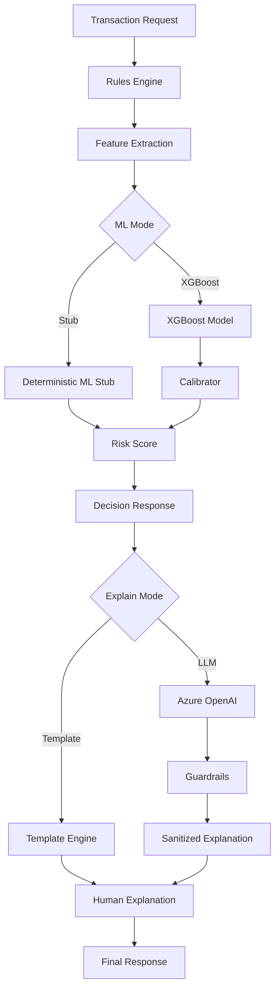

# Phase 2: Explainability Architecture

This document describes the explainability architecture for Orca Core, including the decision flow, Azure setup, and configuration options.

## Architecture Overview

The Orca Core explainability system follows a multi-stage pipeline that transforms raw transaction data into human-readable explanations through a combination of rule-based logic, machine learning, and large language models.

### Decision Flow Architecture



### Detailed Component Flow

1. **Input Processing**: Transaction data is received and validated
2. **Rules Evaluation**: Business rules are applied to determine initial decision
3. **Feature Engineering**: Raw data is transformed into ML features
4. **ML Prediction**: Either stub or XGBoost model generates risk score
5. **Calibration**: XGBoost scores are calibrated for better probability estimates
6. **Decision Synthesis**: Rules and ML results are combined
7. **Explanation Generation**: Human-readable explanations are created
8. **Guardrail Validation**: LLM explanations are validated and sanitized
9. **Response Assembly**: Final decision and explanation are packaged

### Component Details

#### 1. Rules Engine
- **Purpose**: Applies business logic rules to transaction data
- **Components**: ACH rules, card rules, velocity rules, high-risk rules, high-ticket rules
- **Output**: Rule-based decisions and metadata

#### 2. Feature Extraction
- **Purpose**: Transforms raw transaction data into ML-ready features
- **Key Features**:
  - `cart_total`: Transaction amount
  - `velocity_24h`: Transaction frequency
  - `cross_border`: International transaction flag
  - `currency`: Transaction currency
  - `payment_method`: Payment type

#### 3. Machine Learning Pipeline
- **Stub Mode**: Deterministic scoring based on business rules
- **XGBoost Mode**: Gradient boosting model with calibration
- **Calibration**: Platt scaling for probability calibration

#### 4. Explanation Generation
- **Template Mode**: Pre-defined human-readable templates
- **LLM Mode**: Azure OpenAI-generated explanations with guardrails

## Azure Setup

### Prerequisites
- Azure subscription with OpenAI service access
- Azure CLI installed and configured
- Orca Core project dependencies installed

### Configuration Steps

#### Step 1: Run the Azure Configuration Script
```bash
make configure-azure-openai
```

This interactive script will prompt you for:
- Azure OpenAI endpoint URL
- API key
- Deployment name
- Azure subscription details
- Resource group information

#### Step 2: Manual Environment Variable Setup (Alternative)
If you prefer to set environment variables manually:

```bash
# Copy the example configuration
cp .env.example .env.local

# Edit .env.local with your actual values
# The file includes all Phase 2 configuration options

# Or set environment variables directly:
export AZURE_OPENAI_ENDPOINT="https://your-resource.openai.azure.com/"
export AZURE_OPENAI_API_KEY="your-api-key"
export AZURE_OPENAI_DEPLOYMENT="your-deployment-name"
export AZURE_OPENAI_API_VERSION="2024-02-15-preview"

# Optional: Customize model parameters
export AZURE_OPENAI_TEMPERATURE="0.7"
export AZURE_OPENAI_MAX_TOKENS="500"
```

#### Step 3: Verify Configuration
```bash
# Check configuration status
python -m orca_core.cli config

# Test Azure OpenAI connection
make test-llm
```

#### Step 4: Test the Setup
```bash
# Test with a simple decision
python -m orca_core.cli decide '{"cart_total": 100.0}' --mode ai --explain yes

# Test batch processing
python -m orca_core.cli decide-batch --glob "fixtures/requests/*.json" --mode ai
```

### Environment Variables

| Variable | Description | Required |
|----------|-------------|----------|
| `AZURE_OPENAI_ENDPOINT` | Azure OpenAI service endpoint | Yes |
| `AZURE_OPENAI_API_KEY` | API key for authentication | Yes |
| `AZURE_OPENAI_DEPLOYMENT` | Model deployment name | Yes |
| `AZURE_OPENAI_API_VERSION` | API version to use | Yes |
| `AZURE_OPENAI_TEMPERATURE` | Model temperature (default: 0.7) | No |
| `AZURE_OPENAI_MAX_TOKENS` | Maximum tokens per response (default: 500) | No |

## Configuration Options

### Toggle Between Stub and XGBoost Models

The Orca Core system supports two ML modes: a fast deterministic stub model and a sophisticated XGBoost model. The choice depends on your performance and accuracy requirements.

#### Method 1: Environment Variables
```bash
# Use XGBoost model (recommended for production)
export ORCA_USE_XGB=true

# Use stub model (recommended for development/testing)
export ORCA_USE_XGB=false
```

#### Method 2: CLI Override
```bash
# Use XGBoost for a single decision
python -m orca_core.cli decide '{"cart_total": 100.0}' --ml xgb

# Use stub for a single decision
python -m orca_core.cli decide '{"cart_total": 100.0}' --ml stub
```

#### Method 3: Configuration File
Create a `.env` file in the project root:
```env
ORCA_USE_XGB=true
ORCA_MODE=RULES_PLUS_AI
ORCA_EXPLAIN_ENABLED=true
```

#### Method 4: Makefile Commands
```bash
# Test with XGBoost model
make test-xgb

# Test with stub model
make test-llm-stub

# Test with LLM explanations
make test-llm
```

### Model Comparison

| Aspect | Stub Model | XGBoost Model |
|--------|------------|---------------|
| **Speed** | ~1ms | ~10-50ms |
| **Accuracy** | Deterministic | High accuracy |
| **Memory** | Minimal | ~50MB |
| **Dependencies** | None | XGBoost, scikit-learn |
| **Use Case** | Development, testing | Production, compliance |
| **Explainability** | Rule-based | Feature importance + LLM |

### Stub Model Logic

The stub model uses deterministic business rules:

```python
# Example stub scoring logic
def predict_risk_stub(features):
    base_score = 0.35

    # Amount-based scoring
    if features.get('amount', 0) > 1000:
        base_score += 0.2

    # Velocity-based scoring
    if features.get('velocity_24h', 0) > 5:
        base_score += 0.1

    # Cross-border penalty
    if features.get('cross_border', 0) == 1:
        base_score += 0.1

    # Clamp to [0, 1] range
    return min(max(base_score, 0.0), 1.0)
```

### XGBoost Model Features

The XGBoost model provides:

- **Gradient Boosting**: Ensemble of decision trees
- **Calibration**: Platt scaling for probability calibration
- **Feature Importance**: Identifies key decision factors
- **Model Persistence**: Trained models saved to disk
- **Versioning**: Model metadata and version tracking

### Decision Modes

| Mode | Description | ML Model | Explanations |
|------|-------------|----------|--------------|
| `RULES_ONLY` | Rule-based decisions only | Stub | Template |
| `RULES_PLUS_AI` | Rules + AI explanations | XGBoost | LLM + Guardrails |

### Explanation Modes

| Mode | Description | Use Case |
|------|-------------|----------|
| `template` | Pre-defined templates | Fast, consistent explanations |
| `llm` | AI-generated explanations | Detailed, contextual explanations |

## Usage Examples

### Basic Decision with Stub Model
```bash
python -m orca_core.cli decide '{"cart_total": 100.0, "currency": "USD"}'
```

### Decision with XGBoost and LLM Explanations
```bash
python -m orca_core.cli decide '{"cart_total": 1000.0, "velocity_24h": 5}' --ml xgb --mode ai --explain yes
```

### Batch Processing
```bash
python -m orca_core.cli decide-batch --glob "fixtures/requests/*.json" --ml xgb --format table
```

### File-based Decision
```bash
python -m orca_core.cli decide-file fixtures/requests/high_risk_decline.json --ml xgb
```

## Model Training

### Train XGBoost Model
```bash
python -m orca_core.cli train-xgb --samples 10000 --model-dir models/
```

### Generate Model Evaluation Plots
```bash
python -m orca_core.cli generate-plots
```

## Debug and Monitoring

### Debug UI
```bash
python -m orca_core.cli debug-ui --port 8501
```

### Model Information
```bash
python -m orca_core.cli model-info
```

### Configuration Status
```bash
python -m orca_core.cli config
```

## Guardrails

The LLM explanation system includes comprehensive guardrails to ensure safe, accurate, and compliant explanations.

### Guardrail Components

#### 1. JSON Schema Validation
- Ensures responses follow the expected structure
- Validates required fields are present
- Checks data types and formats

#### 2. Hallucination Detection
- Identifies potentially false or fabricated information
- Uses confidence scoring to detect uncertainty
- Flags responses that may contain inaccurate details

#### 3. Content Validation
- **PII Detection**: Identifies personally identifiable information
- **Legal Advice**: Detects attempts to provide legal guidance
- **Guarantees**: Identifies promises or guarantees that shouldn't be made
- **Forbidden Patterns**: Blocks specific problematic phrases

#### 4. Uncertainty Detection
- Identifies when the model expresses uncertainty
- Flags responses with low confidence scores
- Ensures explanations are definitive when required

#### 5. Sanitization
- Removes or replaces problematic content
- Maintains explanation quality while ensuring safety
- Provides fallback explanations when needed

### Guardrail Configuration

```python
# Example guardrail settings
GUARDRAIL_CONFIG = {
    "max_hallucination_score": 0.3,
    "forbidden_patterns": [
        "guarantee", "promise", "legal advice",
        "definitely", "certainly", "always"
    ],
    "uncertainty_threshold": 0.7,
    "pii_patterns": [
        r"\b\d{3}-\d{2}-\d{4}\b",  # SSN
        r"\b\d{4}[-\s]?\d{4}[-\s]?\d{4}[-\s]?\d{4}\b"  # Credit card
    ],
    "max_response_length": 500,
    "min_confidence_score": 0.8
}
```

### Guardrail Response Types

| Response Type | Description | Action |
|---------------|-------------|---------|
| `VALID` | All checks passed | Use LLM explanation |
| `HALLUCINATION` | Potential false information | Use template fallback |
| `CONTENT_VIOLATION` | Forbidden content detected | Sanitize and use |
| `UNCERTAINTY` | Model expresses uncertainty | Use template fallback |
| `SCHEMA_ERROR` | Invalid JSON format | Use template fallback |

### Customizing Guardrails

You can customize guardrail behavior by setting environment variables:

```bash
# Adjust hallucination sensitivity
export ORCA_GUARDRAIL_HALLUCINATION_THRESHOLD=0.2

# Add custom forbidden patterns
export ORCA_GUARDRAIL_FORBIDDEN_PATTERNS="custom_pattern1,custom_pattern2"

# Set uncertainty threshold
export ORCA_GUARDRAIL_UNCERTAINTY_THRESHOLD=0.8
```

## Performance Considerations

### Model Selection Guidelines

| Scenario | Recommended Model | Reason |
|----------|------------------|---------|
| Development/Testing | Stub | Fast, deterministic |
| Production (Low Volume) | XGBoost | Better accuracy |
| Production (High Volume) | Stub | Performance |
| Compliance/Audit | XGBoost + LLM | Detailed explanations |

### Caching
- XGBoost models are cached after first load
- LLM responses can be cached for identical requests
- Feature extraction results are cached per session

## Troubleshooting

### Common Issues

1. **Azure OpenAI Connection Failed**
   ```bash
   # Check configuration
   python -m orca_core.cli config

   # Verify API key
   curl -H "api-key: $AZURE_OPENAI_API_KEY" "$AZURE_OPENAI_ENDPOINT/openai/deployments/$AZURE_OPENAI_DEPLOYMENT/chat/completions?api-version=$AZURE_OPENAI_API_VERSION"
   ```

2. **Model Loading Errors**
   ```bash
   # Check model files
   ls -la models/

   # Retrain model
   python -m orca_core.cli train-xgb
   ```

3. **Guardrail Failures**
   - Check guardrail configuration
   - Review explanation content for violations
   - Adjust thresholds if needed

### Logging
Enable debug logging:
```bash
export ORCA_LOG_LEVEL=DEBUG
python -m orca_core.cli decide '{"cart_total": 100.0}'
```

## Security Considerations

1. **API Key Management**: Store API keys securely, never commit to version control
2. **Data Privacy**: Ensure transaction data is handled according to privacy requirements
3. **Audit Trail**: Log all decisions and explanations for compliance
4. **Access Control**: Implement proper authentication and authorization

## Quick Reference

### Essential Commands

```bash
# Setup
make configure-azure-openai    # Configure Azure OpenAI
make test-config              # Verify configuration

# Model Training
make train-xgb               # Train XGBoost model
make model-info              # Show model information
make generate-plots          # Generate evaluation plots

# Testing
make test-xgb                # Test with XGBoost
make test-llm                # Test with LLM explanations
make test-llm-stub           # Test with stub model

# Debugging
make debug-ui                # Launch debug UI
python -m orca_core.cli config  # Check configuration
```

### Environment Variables Quick Reference

| Variable | Purpose | Default |
|----------|---------|---------|
| `ORCA_USE_XGB` | Enable XGBoost model | `false` |
| `ORCA_MODE` | Decision mode | `RULES_ONLY` |
| `ORCA_EXPLAIN_ENABLED` | Enable explanations | `false` |
| `AZURE_OPENAI_ENDPOINT` | Azure OpenAI endpoint | Required |
| `AZURE_OPENAI_API_KEY` | Azure OpenAI API key | Required |
| `AZURE_OPENAI_DEPLOYMENT` | Model deployment name | Required |

### Common Use Cases

#### Development/Testing
```bash
# Fast testing with stub model
export ORCA_USE_XGB=false
python -m orca_core.cli decide '{"cart_total": 100.0}'
```

#### Production with AI Explanations
```bash
# Full AI pipeline
export ORCA_USE_XGB=true
export ORCA_MODE=RULES_PLUS_AI
python -m orca_core.cli decide '{"cart_total": 1000.0}' --explain yes
```

#### Batch Processing
```bash
# Process multiple requests
python -m orca_core.cli decide-batch --glob "data/*.json" --ml xgb --format csv
```

## Future Enhancements

1. **Multi-model Support**: Support for additional ML models
2. **Custom Templates**: User-defined explanation templates
3. **A/B Testing**: Compare explanation effectiveness
4. **Real-time Monitoring**: Live performance and accuracy metrics
5. **Federated Learning**: Distributed model training
6. **Custom Guardrails**: User-defined safety rules
7. **Explanation Analytics**: Track explanation quality and usage
8. **Multi-language Support**: Explanations in multiple languages
